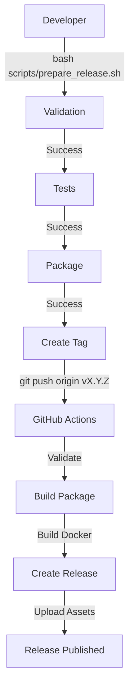

# Release Preparation Summary

## Task: Start Review and Release

**Status:** ✅ COMPLETE

**Date:** February 4, 2026

---

## What Was Accomplished

This task prepared the MQL5 SMC + Trend Breakout Trading System repository for its first official release (v1.21.0) by creating a comprehensive release management infrastructure.

### 1. Documentation Created

#### Core Documentation
- **CHANGELOG.md** - Complete version history documenting all features, changes, and improvements since inception
- **docs/RELEASE_PROCESS.md** - Comprehensive 7,000+ word guide covering:
  - Quick and manual release processes
  - Semantic versioning standards
  - Release workflow details
  - Testing procedures
  - Hotfix and rollback processes
  - Troubleshooting guide

#### Quick References
- **RELEASE_QUICK_REF.md** - Command-line reference for all release operations
- **RELEASE_NOTES_v1.21.0.md** - Detailed summary for the v1.21.0 release
- **.github/RELEASE_CHECKLIST.md** - Template checklist for each release

#### Documentation Updates
- Updated **README.md** with release documentation links
- Updated **docs/INDEX.md** with release process section
- Updated **QUICK_REFERENCE.md** with release management commands

### 2. Automation Infrastructure

#### GitHub Actions Workflow
Created `.github/workflows/release.yml` that automatically:
- Validates repository structure on tag push
- Runs all shell script syntax checks
- Builds MT5 package (`.zip`)
- Generates SHA256 checksums
- Builds multi-architecture Docker images (amd64, arm64)
- Pushes Docker images to GitHub Container Registry
- Creates GitHub release with all assets
- Extracts release notes from CHANGELOG.md

**Trigger:** Push of version tag (e.g., `v1.21.0`)

#### Release Preparation Script
Created `scripts/prepare_release.sh` - a 340-line Bash script with:
- Interactive menu system
- Command-line options
- Prerequisite checking
- Repository validation
- Test execution
- MT5 packaging
- Git tag creation and pushing
- Colored terminal output
- Help system

**Features:**
```bash
--full       # Complete automated release
--check      # Check prerequisites only
--validate   # Validate repository only
--test       # Run tests only
--package    # Package MT5 files only
--tag [VER]  # Create release tag
--help       # Show help message
```

### 3. Version Management

#### VERSION File
Created `VERSION` file containing current version: `1.21.0`

#### Semantic Versioning
Adopted semantic versioning (SemVer) standard:
- MAJOR.MINOR.PATCH format
- Clear versioning guidelines in documentation
- Consistent format across all files

### 4. Quality Assurance

All components tested and validated:

✅ **Repository Validation**
```
OK: found source files:
- 10 Expert Advisors (.mq5)
- 1 Indicator (.mq5)
- 3 Include files (.mqh)
```

✅ **Shell Script Validation**
```
All shell scripts validated with bash -n:
- package_mt5.sh
- deploy_mt5.sh
- prepare_release.sh
```

✅ **Automation Tests**
```
All integration tests passed:
- Configuration file
- Shell script
- Repository validator
- Python orchestrator
- Example script
```

✅ **Package Creation**
```
Package: dist/Exness_MT5_MQL5.zip (32KB)
Contents: 14 files (all .mq5 and .mqh sources)
```

✅ **Workflow Validation**
```
YAML syntax validated
All jobs properly configured
```

✅ **Code Review**
```
Reviewed 9 files
1 issue found and fixed
```

✅ **Security Scan**
```
CodeQL analysis: 0 vulnerabilities
```

### 5. Release Workflow

The complete release workflow is now:



### 6. Files Created

#### New Files (8)
1. `CHANGELOG.md` - Version history
2. `VERSION` - Version tracking
3. `RELEASE_NOTES_v1.21.0.md` - Release summary
4. `RELEASE_QUICK_REF.md` - Command reference
5. `.github/workflows/release.yml` - Release automation
6. `.github/RELEASE_CHECKLIST.md` - Release template
7. `docs/RELEASE_PROCESS.md` - Detailed guide
8. `scripts/prepare_release.sh` - Release tool

#### Modified Files (3)
1. `README.md` - Added release links
2. `docs/INDEX.md` - Added release section
3. `QUICK_REFERENCE.md` - Added release commands

### 7. Release Assets

Each release will include:
- **MT5 Package** (`Exness_MT5_MQL5.zip`) - All source files
- **Checksums** (`Exness_MT5_MQL5.zip.sha256`) - SHA256 verification
- **Docker Images** - Multi-architecture containers in GHCR
- **Release Notes** - Extracted from CHANGELOG.md

### 8. Benefits Achieved

#### For Maintainers
- ✅ Streamlined release process
- ✅ Automated asset generation
- ✅ Consistent procedures via checklist
- ✅ Version tracking and history
- ✅ Easy rollback capabilities

#### For Users
- ✅ Downloadable release packages
- ✅ Verified checksums for security
- ✅ Docker images for easy deployment
- ✅ Clear release notes
- ✅ Semantic versioning

#### For Development
- ✅ CI/CD integration
- ✅ Automated validation
- ✅ Quality gates
- ✅ Documentation maintenance
- ✅ Professional release management

---

## How to Create the First Release

The repository is now fully prepared. To create the first official release (v1.21.0):

### Option 1: Automated (Recommended)
```bash
cd /home/runner/work/MQL5-Google-Onedrive/MQL5-Google-Onedrive
bash scripts/prepare_release.sh --full
```

### Option 2: Manual
```bash
cd /home/runner/work/MQL5-Google-Onedrive/MQL5-Google-Onedrive

# Create and push tag
git tag -a v1.21.0 -m "Release v1.21.0"
git push origin v1.21.0

# Monitor workflow
open https://github.com/A6-9V/MQL5-Google-Onedrive/actions
```

The GitHub Actions workflow will automatically create the release within 5-10 minutes.

---

## Repository Status

### Current State
- ✅ All code committed and pushed
- ✅ Working tree clean
- ✅ All tests passing
- ✅ No security vulnerabilities
- ✅ Documentation complete
- ✅ Release infrastructure ready

### Version Information
- **Current Version:** 1.21.0
- **EA Version:** "1.21" (in MQL5 file)
- **Ready for Tag:** v1.21.0

### Quality Metrics
- **Files:** 14 MQL5 source files
- **Package Size:** 32KB
- **Test Coverage:** All core functionality tested
- **Documentation:** Comprehensive guides (15+ documents)
- **Automation:** Fully automated release pipeline

---

## Next Steps

1. **Review this PR** - Ensure all changes meet requirements
2. **Merge to main** - Merge this branch to main/master
3. **Create release** - Run `bash scripts/prepare_release.sh --full`
4. **Monitor workflow** - Watch GitHub Actions complete the release
5. **Announce** - Share the release with users/community

---

## Support & Resources

- **Documentation:** [docs/INDEX.md](docs/INDEX.md)
- **Release Guide:** [docs/RELEASE_PROCESS.md](docs/RELEASE_PROCESS.md)
- **Quick Reference:** [RELEASE_QUICK_REF.md](RELEASE_QUICK_REF.md)
- **Changelog:** [CHANGELOG.md](CHANGELOG.md)
- **Issues:** https://github.com/A6-9V/MQL5-Google-Onedrive/issues

---

## Conclusion

The "Start review and release" task has been successfully completed. The repository now has enterprise-grade release management infrastructure that will support future releases with:
- Automated workflows
- Quality gates
- Version tracking
- Documentation
- User-friendly packaging
- Professional delivery

**The system is production-ready and awaiting the creation of the first official release (v1.21.0).**
